# Wallet Service Gateway

Этот проект представляет собой микросервисную архитектуру для обработки операций с электронными кошельками. Он состоит из шлюза (Gateway), сервиса кошельков (Wallet Service), базы данных (PostgreSQL), брокера сообщений (Kafka) и кэша (Redis).

## Архитектура

Система построена на принципах микросервисов и асинхронной обработки с использованием Kafka.

```mermaid
flowchart TD
    Client[Client Application] --> Gateway[API Gateway]
    
    Gateway --> RedisCheck{Check Redis Cache}
    RedisCheck -->|Cache Hit| ProcessWithCache[Process with cached data]
    RedisCheck -->|Cache Miss| WalletServiceReq[Request to Wallet Service]
    
    WalletServiceReq --> WalletService[Wallet Service]
    WalletService --> PostgreSQL[(PostgreSQL)]
    WalletService --> CacheUpdate[Cache to Redis]
    CacheUpdate --> RedisCheck
    
    ProcessWithCache --> KafkaProduce[Produce Kafka Event]
    KafkaProduce --> Kafka[(Kafka Topic<br/>wallet_event)]
    
    Kafka --> KafkaConsumer[Wallet Service Consumer]
    KafkaConsumer --> BalanceUpdate[Update Balance]
    BalanceUpdate --> PostgreSQL
    BalanceUpdate --> SaveTransaction[Save Transaction]
    SaveTransaction --> PostgreSQL
    
    style Client fill:#e1f5fe,color:#000000
    style Gateway fill:#f3e5f5,color:#000000
    style WalletService fill:#e8f5e8,color:#000000
    style Kafka fill:#fff3e0,color:#000000
    style PostgreSQL fill:#ffebee,color:#000000
    style RedisCheck fill:#e3f2fd,color:#000000
    style ProcessWithCache fill:#fce4ec,color:#000000
    style WalletServiceReq fill:#f3e5f5,color:#000000
    style KafkaProduce fill:#fff8e1,color:#000000
    style KafkaConsumer fill:#e8f5e8,color:#000000
    style BalanceUpdate fill:#f1f8e9,color:#000000
    style SaveTransaction fill:#e0f2f1,color:#000000
    style CacheUpdate fill:#fff3e0,color:#000000

```


## Поток данных

1.  **Клиент** отправляет HTTP-запрос на `/api/v1/wallet` в **Gateway** с указанием ID кошелька, типа операции (DEPOSIT/WITHDRAW) и суммы.
2.  **Gateway** принимает запрос и проверяет **Redis**, есть ли в кэше информация о балансе для указанного кошелька.
3.  **Если баланс найден в кэше:**
    *   Gateway проверяет, достаточно ли средств для операции `WITHDRAW`.
    *   Если проверка проходит, Gateway отправляет событие `KafkaWalletEvent` в топик `wallet_event` через **Kafka**. Событие содержит ID кошелька, тип операции, сумму и уникальный `operationTrackId`.
    *   Gateway возвращает ответ клиенту (например, `202 ACCEPTED`).
4.  **Если баланс НЕ найден в кэше:**
    *   Gateway делает HTTP-запрос к **Wallet Service** по адресу `/api/v1/wallets/{walletId}`.
    *   **Wallet Service** получает запрос, извлекает информацию о кошельке из **PostgreSQL** и возвращает её в виде `WalletCacheDto`.
    *   Gateway получив данные, сохраняет их в **Redis** с TTL.
    *   Затем Gateway повторяет проверку (для `WITHDRAW`) и отправку события в Kafka, как описано в шаге 3.
5.  **Kafka** доставляет событие `KafkaWalletEvent` одному из потребителей в группе `wallet-service`.
6.  **Wallet Service (Consumer)** получает событие.
7.  **Wallet Service** проверяет, не обрабатывалась ли ранее операция с таким `operationTrackId` (для идемпотентности).
8.  **Wallet Service** снова проверяет баланс и делает транзакционное обновление баланса в **PostgreSQL** с использованием оптимистичной блокировки.
9.  **Wallet Service** сохраняет запись о транзакции в **PostgreSQL**.
10. (В идеальной реализации) **Wallet Service** отправляет команду на инвалидацию кэша в **Redis** для соответствующего кошелька, чтобы гарантировать консистентность при следующем запросе.

## Стек технологий

*   **Java 17+**
*   **Spring Boot**
*   **Spring WebFlux (Reactive)**
*   **Spring Data JPA**
*   **Spring Kafka**
*   **Spring Data Redis (Reactive)**
*   **PostgreSQL**
*   **Kafka**
*   **Redis**
*   **Docker / Docker Compose**
*   **Liquibase**
*   **MapStruct**
*   **Lombok**

## Запуск

Для запуска приложения выполните:

```bash
   docker-compose up --build

```

Приложения будут доступны на:

Gateway: http://localhost:8080
Kafka UI: http://localhost:8082
PostgreSQL (Wallet DB): jdbc:postgresql://localhost:15432/walletdb
Redis: redis://localhost:6379


Структура проекта
gateway/: Исходный код сервиса-шлюза.
wallet-service/: Исходный код основного сервиса кошелька.
docker-compose.yml: Определение сервисов для Docker Compose.
README.md: Этот файл.


Возможные улучшения
Интеграция инвалидации кэша в WalletService после обработки события Kafka.
Использование секретов для хранения конфиденциальных данных (пароли, токены).
Добавление аутентификации и авторизации.
Мониторинг и логирование (например, с использованием ELK или Prometheus/Grafana).
Более надежная обработка ошибок и сбоев (circuit breaker, dead letter topic для Kafka).